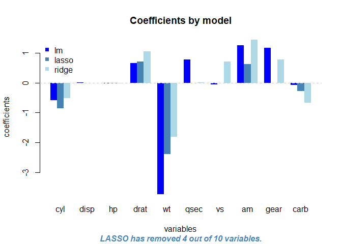
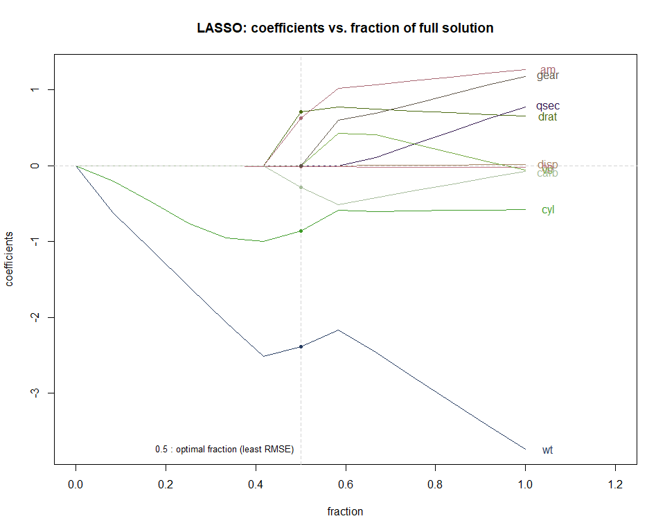
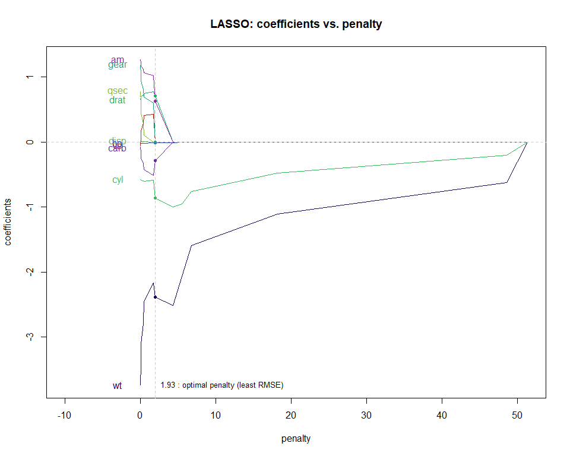
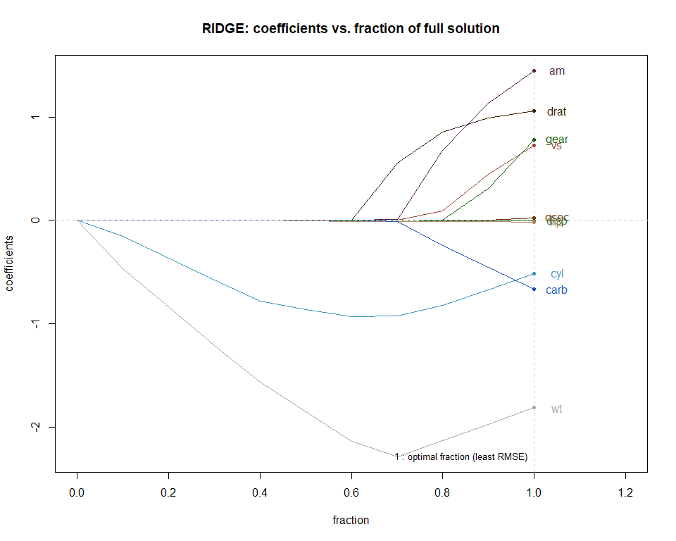
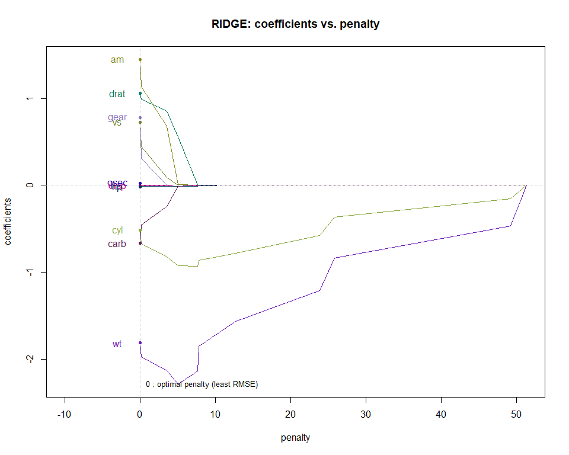

In the lecture on Regularized Regression under the Practical Machine Learning course of Coursera's Data Science Specialization, we were introduced to the theoretical concepts of two penalized regression models: ridge and LASSO (Least Absolute Shrinkage and Selection Operator). 

**Below is an attempt to:**  
1. Support that theory with a practical example using the ``mtcars`` dataset and the ``caret package`` to obtain a visual understanding of the concept of shrinking coefficients.  
2. Compare goodness of fit on training data and prediction accuracy on test data across linear model (LM), ridge, and LASSO.  
3. Explore the goodness of fit and prediction accuracy implications of feature selection in LM using LASSO.  


First, a quick look at the dataset. 

```r
head(mtcars)
```

```
##                    mpg cyl disp  hp drat    wt  qsec vs am gear carb
## Mazda RX4         21.0   6  160 110 3.90 2.620 16.46  0  1    4    4
## Mazda RX4 Wag     21.0   6  160 110 3.90 2.875 17.02  0  1    4    4
## Datsun 710        22.8   4  108  93 3.85 2.320 18.61  1  1    4    1
## Hornet 4 Drive    21.4   6  258 110 3.08 3.215 19.44  1  0    3    1
## Hornet Sportabout 18.7   8  360 175 3.15 3.440 17.02  0  0    3    2
## Valiant           18.1   6  225 105 2.76 3.460 20.22  1  0    3    1
```

Miles per gallon or ``mpg`` will be our response variable and all others will form explanatory variables. With that, let us now make three models: LM, ridge, and LASSO. 

```r
# splitting dataset into train and test sets
set.seed(321321)
rowtrain = createDataPartition(mtcars$mpg, p = 0.80, list = FALSE)
mtcarstrain = mtcars[rowtrain,]
mtcarstest = mtcars[-rowtrain,]

# models
fit.lm = train(data = mtcarstrain, mpg~., method = "lm")
fit.lasso = train(data = mtcarstrain, mpg~., method = "lasso")
fit.ridge = train(data = mtcarstrain, mpg~., method = "ridge")
```

### Comparing coefficients  

Both ridge and LASSO shrink the magnitude of coefficients of explanatory variables based on their relevance. LASSO in particular, can reduce the magnitude of certain explanatory variables to absolute zero for "retaining a subset of the most relevant predictors and deleting the remaining explanatory variables" [(Wei, et al., 2015)](https://cyberleninka.org/article/n/1372250.pdf). For this reason, LASSO can be used for feature selection.  

Let us look at the coefficients in our example: 


```
##                      lm       lasso        ridge
## (Intercept) 13.89871130 32.54981353 25.472556250
## cyl         -0.57770362 -0.86199904 -0.514951768
## disp         0.01734130  0.00000000 -0.001613763
## hp          -0.02224712 -0.01123541 -0.015614295
## drat         0.65772634  0.71070780  1.061733291
## wt          -3.73370110 -2.38814015 -1.811672426
## qsec         0.77797522  0.00000000  0.020708395
## vs          -0.05953056  0.00000000  0.722900285
## am           1.26647538  0.63011356  1.445897690
## gear         1.18032153  0.00000000  0.778329952
## carb        -0.07623185 -0.28123338 -0.663759168
```




### Shrinking of coefficients: LASSO  

Let us view graphically, how LASSO shrinks the magnitudes of the coefficients with the tuning parameter ``fraction`` - where fraction, as per R Documentation for ``elasticnet::predict.enet``, is the "ratio of the L1 norm of the coefficient vector, relative to the norm at the full LS solution." 

And, according to Wei, et al., "The smaller values of the fraction of full solution mean a greater shrinkage. When the fraction of full solution is one, then the Lasso model becomes ordinary least square with no penalty (i.e. a full linear model)." 
  


Note that the value of coefficients marked at the point of optimal fraction are the same as seen in the previous section comparing coefficients against LM. For LASSO, the final value of fraction is selected by default as the one that offers the smallest value of RMSE (Root Mean Square Error). 


```r
fit.lasso$results
```

```
##   fraction     RMSE  Rsquared      MAE   RMSESD RsquaredSD     MAESD
## 1      0.1 4.421101 0.7473110 3.489146 1.091656  0.1213076 0.9640786
## 2      0.5 3.684640 0.6628724 2.992822 1.590106  0.1625879 1.2459998
## 3      0.9 4.670293 0.5560617 3.703985 2.940148  0.2329185 2.1049974
```

```r
fit.lasso$bestTune
```

```
##   fraction
## 2      0.5
```

Now to see how LASSO shrinks coefficients by ``penalty``. 



Optimal penalty is the value of penalty for that value of fraction of full solution that delivers least RMSE.  

### Shrinking of coefficients: ridge  

For ridge, the tuning parameter is ``lambda``. 

```r
fit.ridge$results
```

```
##   lambda     RMSE  Rsquared      MAE    RMSESD RsquaredSD     MAESD
## 1  0e+00 5.128580 0.5581311 4.103534 2.2555685 0.22346455 1.7474514
## 2  1e-04 5.062971 0.5610161 4.053388 2.1591516 0.22022743 1.6724943
## 3  1e-01 3.102315 0.7647484 2.478999 0.5325481 0.07818739 0.4957213
```

```r
fit.ridge$bestTune
```

```
##   lambda
## 3    0.1
```

However, the ``predict``/``predict.enet`` methods to find coefficients for fitted enet object formed for the ridge model (``fit.ridge$finalModel``) do not accept ``lambda`` as a mode. Hence, for ridge too, we will view coefficient shrinkage first against fraction and then penalty.  





### Comparing goodness of fit  

Uses ``results`` element of ``train`` object, e.g. ``fit.lasso$results``.  


```
##            lm lasso ridge
## RMSE     4.32  3.68  3.10
## Rsquared 0.59  0.66  0.76
```

``ridge`` appears to perform the best in our example. 

### Comparing prediction accuracy  

Uses ``postResample()``, e.g. ``postResample(predict(fit.lasso, newdata = mtcarstest), mtcarstest$mpg)``.


```
##            lm lasso ridge
## RMSE     3.06  3.48  2.92
## Rsquared 0.88  0.94  0.94
```

Again, ``ridge`` appears to perform the best in our example. ``lasso`` actually increases error in comparison to ``lm``. 

### Using LASSO for feature selection 

Feature selection eliminates redundant variables to reduce overfitting and make the model simpler and more interpretable. It enables working with high-dimensional data. In a previous section, we already saw LASSO enabling feature selection, shrinking the coefficients of four variables--"disp", "qsec", "vs", "gear"--to zero.  

So we now set up a new LM with ``mpg`` as the response variable and all others *excluding the four eliminated by LASSO* as explanatory variables.  


```r
lm.lassoftselect = train(data = mtcarstrain, mpg~cyl + hp + drat + wt + am + carb, method = "lm")
```

Let us compare the performance of the new model with the old one:  

**Goodness of fit with training data set**


```
##            lm lm.lassoftselect
## RMSE     4.32             3.57
## Rsquared 0.59             0.71
```

LM post feature selection performs better.  

**Prediction accuracy with test data set**


```
##            lm lm.lassoftselect
## RMSE     3.06             3.21
## Rsquared 0.88             0.95
```

In terms of prediction accuracy, the LM post feature selection improves Rsquared, but increases error.  

Hence, LASSO-based feature selection should be chosen in accordance to priorities - prediction accuracy vs model simplicity. 


### APPENDIX 

Sharing the function used to capture the intercept and coefficients of ``ridge`` and ``lasso``, as well as the function used to plot the coefficient shrinkage.  

**NOTE**, we have constructed our own plotting function vs using elasticnet::plot.enet mainly to show actual value of coefficients vs standardized coefficients. In addition, our function names every variable vs skipping some for sake of space and automatically marks the optimal values of fraction and penalty.  

**COEFFICIENTS**  


```r
trainLR.coef <- function(x){
    # return intercept and coefficients for train objects of  
    # penalized linear models with method value of lasso or ridge only
    
    # stop with error if object passed is not of class train.formula and 
    # is not called with method value of either lasso or ridge 
    
    if(!(class(x)[2] == "train.formula" & x$call$method %in% c("lasso", "ridge"))){
        stop("Not a train object with 'lasso' or 'ridge' method value")}
    
    tunevalue = numeric()
    
    # if object is a LASSO train.formula, tunevalue = bestTune$fraction
    # else it is a ridge train, hence tunevalue = 1
    # for choice of tunevalue, see predict method in x$modelInfo
    
    ifelse(x$call$method == "lasso", 
           tunevalue <- x$bestTune$fraction, 
           tunevalue <- 1
           )
    
    
    # intecept = Yhat - sum(Xs * coefficients of Xs)
    
    intercept = 
        as.numeric(predict(x, x$trainingData[1:2,]))[1] - 
        sum(x$trainingData[1,-1] * 
                predict(x$finalModel, 
                        type = "coefficients", 
                        mode = "fraction", 
                        s = tunevalue
                )$coefficients
            )
    
    # coefficients
    coefs = predict(x$finalModel, 
                    type = "coefficients", 
                    mode = "fraction", 
                    s = tunevalue
                    )$coefficients
    
    # concatenating intercept and coefficients 
    output = c(intercept, coefs)
    # named numeric output, 
    # with names being (Intercept) or names of the explanatory variables
    attributes(output)$names[1] = "(Intercept)"
    
    return(output)

}
```

**PLOTTING COEFFICIENTS**  


```r
trainLR.plot <- function(x, mode = "fraction"){
    
    # stop with error message of passed object is not of class train.formula
    # or of method value 'lasso' or 'ridge'
    if(!(class(x)[2] == "train.formula" & x$call$method %in% c("lasso", "ridge"))){
        stop("Not a train object with 'lasso' or 'ridge' method value")}
    
    # stop with error message if argument mode is other than 'fraction' or 'penalty'
    if(!(mode %in% c("fraction", "penalty"))){
        stop("Mode can take values: 'fraction' or 'penalty'")}
    
    # get all iterations of fractions of full solution and coefficient values
    # which have been evaluated before choosing best solution: delivering least RMSE
    model = predict(x$finalModel, type = "coefficients", mode = "fraction", 
                    s = predict(x$finalModel, 
                                type = "coefficients", 
                                mode = "fraction"
                                )$fraction
                    )
    
    # named vector of 'n' distinct colors
    colorlist = character()
    for(i in 1:ncol(model$coefficient)){
        
        colorlist[i] = rgb(sample(seq(0, 200, by = 1), 1), 
                           sample(seq(0, 200, by = 1), 1), 
                           sample(seq(0, 200, by = 1), 1), 
                           maxColorValue = 255)
        
    }
        
    coefnames = colnames(model$coefficients)
    attributes(colorlist)$names = coefnames
    
    # optimal value of tuning parameter
    tunevalue = numeric()
    ifelse(x$call$method == "lasso", 
           tunevalue <- x$bestTune$fraction, 
           tunevalue <- 1
    )
    
    xvals = numeric()
    xlims = numeric(); optitune = numeric(); labelpos = numeric()
    
    ifelse(mode == "fraction", 
           {# fraction
               xvals <- model$fraction
               xlims <- c(0, range(xvals)[2] + 0.2)
               optitune <- tunevalue
               varlabelpos <- 1.05
               tunepos <- 2
               plottitle <- "fraction of full solution"
           }, 
           {# penalty
               xvals <- x$finalModel$penalty
               xlims <- c(-10, range(xvals)[2])
               optitune <- xvals[which(model$fraction == tunevalue)]
               varlabelpos <- -3
               tunepos <- 4
               plottitle <- "penalty"
           }
    )
    
    plot(x = xvals, y = model$coefficients[,1], 
         type = "l", lwd = 1, 
         col = colorlist[coefnames[1]], 
         ylim = range(model$coefficients), 
         xlim = xlims, 
         xlab = mode, ylab = "coefficients")
    
    for(i in 2:ncol(model$coefficients)){
        points(x = xvals, y = model$coefficients[,i], 
               type = "l", lwd = 1, 
               col = colorlist[coefnames[i]])
        }
    
    abline(v = optitune, h = 0, lty = 2, col = "lightgrey")
    
    text(x = optitune, y = min(model$coefficients), 
         labels = paste(round(optitune,1), ": optimal",mode, "(least RMSE)"), cex = 0.8, pos = tunepos)
    
    for(i in 1:ncol(model$coefficients)){
        points(x = optitune, 
               y = model$coefficients[which(model$fraction == tunevalue),i], 
               col = colorlist[coefnames[i]], 
               pch = 20, cex = 1
               )
    }
    
    coeflastrow = sort(model$coefficients[nrow(model$coefficients),], decreasing = TRUE)
    
    text(x = varlabelpos, 
         y = coeflastrow, 
         labels = attributes(coeflastrow)$names, 
         col = colorlist[attributes(coeflastrow)$names]
         )
    
    title(main = paste(toupper(x$call$method),": coefficients vs. ", plottitle, sep = ""))
    
}
```
